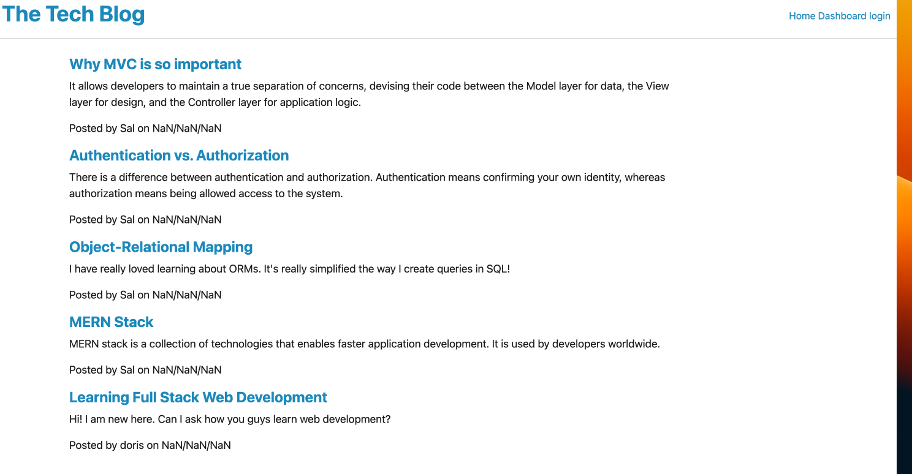

# TechBlog

## Table of Contents

- [Description of the Project](#description)
- [Installation](#installation)
- [Screenshot](#screenshot)
- [Links](#links)
- [License](#license)

## Description

This is a platform where developers can share their thoughts, insights, and knowledge about various technical topics. It serves as a community-driven hub for exchanging ideas, learning from one another, and staying up-to-date with the latest trends and developments in the tech industry.

## Installation

- Install Express.js package
- Uses the MySQL2 and Sequelize packages to connect to a MySQL database.

## Screenshot

## Links

- GitHub: https://github.com/Chenson92/TechBlog
- Heroku: https://techblog-by-doris.herokuapp.com/

## License

This project is licensed under the terms of the MIT license.
[License](https://opensource.org/licenses/MIT)
